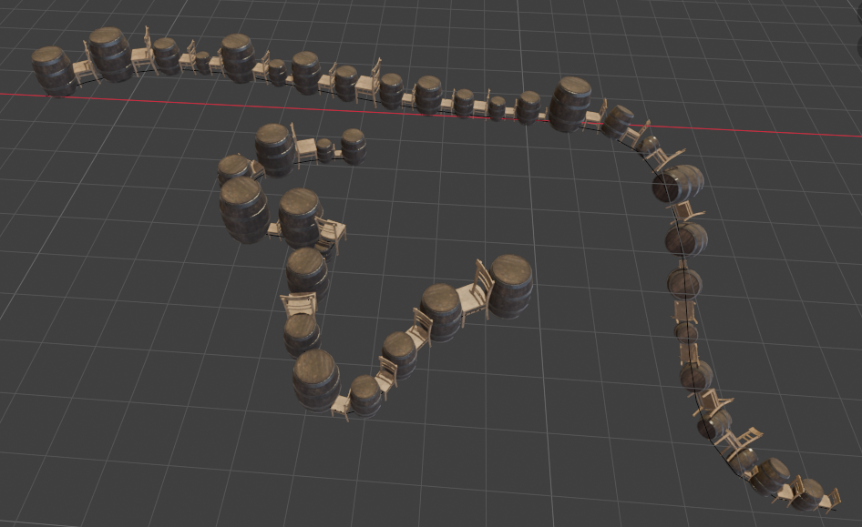

# 🌿 Scatter Objects on Curve (Blender Addon)

A lightweight tool for Blender 4.0+ that lets you easily copy, distribute, and randomize multiple objects along a curve. Perfect for creating chains, tracks, path railings, scattering rocks along a trail, or spacing out sci-fi details!

https://github.com/user-attachments/assets/25ac3030-ffc8-46f7-979b-07dfaf17c96b

---

## ✨ Features
* **Multi-Object Spacing:** Scatter a sequence of different objects or alternate through them.
* **Smart Alignment:** Automatically aligns your objects to follow the curve's curve (tangent) and surface direction (normal).
* **Randomization:** Add natural variation by randomizing spacing, sizing, flips, and rotations.
* **Built-in Presets:** Save your perfect settings so you never have to re-dial them from scratch.

---

## 🛠️ How to Install

1. **Download the script:** Save this addon script somewhere on your computer as a `.py` file (for example: `scatter_on_curve.py`). 
2. **Open Blender** and head to **Edit > Preferences**.
3. Select the **Add-ons** tab on the left.
4. Click the **Install...** button at the top right of the window.
5. Find and select your downloaded `scatter_on_curve.py` file, then click **Install Add-on**.
6. Check the box next to **Object: Scatter Objects on Curve** to enable it.

---

## 📍 Where to Find It

Once enabled, you can find the tool in two places:
1. In the **3D Viewport**, open the top menu: **Object > Scatter Objects on Curve**.
2. Alternatively, press **F3** (or Spacebar, depending on your keymap) and search for: `Scatter Objects on Curve`.

---

## 🚀 How to Use (Step-by-Step)

> ⚠️ **CRITICAL FIRST STEP:** Before doing anything, select your meshes and your curve, press `Ctrl + A` and choose **Apply Scale**. If your objects or curve have unapplied scaling, the math will stretch or break your scattered models!

### The Selection Order Matters!
Blender needs to know *what* you want to copy and *where* you want to put it.

1. **Select your Assets:** Click on the mesh object (or multiple objects) you want to scatter.
2. **Select the Curve LAST:** Hold `Shift` and click your Target Curve. 
   * *The curve must be highlighted in a lighter orange/yellow color. This means it is the "Active" object.*
3. **Run the Addon:** Go to **Object > Scatter Objects on Curve** (or press F3 and search for it).

### Adjusting Your Settings
As soon as you run the tool, your objects will populate the curve, and a **mini settings panel** will pop up in the **bottom-left corner** of your viewport. 

Expand that panel to adjust your scatter on the fly:
* **Points Distance:** How much gap to leave between items.
* **Random Scale / Rotation:** Tick these boxes to make things look messy and natural rather than uniform.
* **Align to Tangent:** Slide this to `1.0` if you want your objects to tilt and face forward down the path of the curve.

---

## 💾 Saving Your Presets

If you find a combination of spacing, scale, and random angles that you love, you can lock it down:
1. In the bottom-left adjustments panel, click the **Save Preset** button at the top.
2. Give your preset a name (e.g., "Fence Posts" or "Scatter Rocks") and hit OK.
3. Next time you run the tool, you can instantly apply those identical values by using the **Load Preset** menu!
